# Laporan Proyek Machine Learning
### Nama : Sri Indriawati
### Nim : 211351141
### Kelas : Pagi A

## Market Basket Analysis Indian Takeaway Food Orders - Apriori Algorithm

<br>
Pesanan makanan India saat ini menjadi salah satu industri yang berkembang pesat di Indonesia. Hal ini disebabkan oleh meningkatnya minat masyarakat Indonesia terhadap makanan India yang lezat dan beragam.
Salah satu cara untuk meningkatkan efisiensi dan efektivitas industri ini adalah dengan melakukan analisis keranjang belanja. Analisis keranjang belanja adalah proses untuk mempelajari pola pembelian pelanggan untuk mengidentifikasi peluang peningkatan penjualan.

**Masalah ini perlu diselesaikan karena :**
Untuk mengidentifikasi item-item yang sering dibeli bersama, item-item yang memiliki potensi untuk meningkatkan penjualan, dan pola pembelian pelanggan. Masalah ini perlu diselesaikan karena informasi ini dapat digunakan untuk meningkatkan efisiensi dan efektivitas industri pesanan makanan India di Indonesia, serta untuk meningkatkan kepuasan pelanggan.

**Cara penyelesaian masalah :**
Masalah ini akan diselesaikan dengan menggunakan analisis keranjang belanja dengan algoritma Apriori. Algoritma Apriori adalah algoritma yang digunakan untuk menemukan aturan asosiasi dalam data transaksional. Aturan asosiasi adalah aturan yang menyatakan bahwa suatu item akan sering dibeli bersama dengan item lain.

## Business Understanding
Tujuan bisnis dari proyek ini adalah untuk meningkatkan penjualan dan kepuasan pelanggan di industri pesanan makanan India.

### Problem Statements
Berdasarkan latar belakang dan masalah yang perlu diselesaikan, maka problem statements dari proyek ini adalah sebagai berikut:
- Apa saja item-item yang sering dibeli bersama?
- Apa saja item-item yang memiliki potensi untuk meningkatkan penjualan?
- Apa pola pembelian pelanggan?

### Goals
Berdasarkan problem statements, maka goals dari proyek ini adalah sebagai berikut:
- Mengidentifikasi item-item yang sering dibeli bersama.
- Mengidentifikasi item-item yang memiliki potensi untuk meningkatkan penjualan.
- Mengidentifikasi pola pembelian pelanggan.

    ### Solution statements
    Berdasarkan goals, maka solution statements dari proyek ini adalah sebagai berikut:
    - Menggunakan algoritma Apriori untuk menemukan aturan asosiasi dalam data transaksional.
    - Menganalisis aturan asosiasi untuk mengidentifikasi item-item yang sering dibeli bersama, item-item yang memiliki potensi untuk meningkatkan penjualan, dan pola pembelian pelanggan.


## Data Understanding
Data yang digunakan dalam proyek ini adalah dataset 19560-indian-takeaway-orders. Dataset ini berisi informasi tentang pesanan makanan India dari berbagai restoran di Indonesia. Data ini terdiri dari 19.560 baris dan 10 kolom, yaitu:
Dataset ini terdiri dari 33 ribu pesanan dari dua restoran takeaway India di London, Inggris. Setiap baris adalah satu produk dalam pesanan.
Disini saya menggunakan dataset dari Restaurant 1, dengan 13 ribu pesanan, 75 ribu baris, dan 248 produk.

### Variabel-variabel pada dataset
Variabel-variabel pada dataset [Takeaway Food Orders](https://www.kaggle.com/datasets/henslersoftware/19560-indian-takeaway-orders) ialah :
| No. | Nama Variabel | Type Data | Keterangan |
|-----|---------------|-----------|------------|
| 1. | Order Number | int64 | Merupakan nomor unik yang diberikan untuk setiap pesanan. |
| 2. | Order Date | object | Merupakan  tanggal dan waktu pesanan dilakukan. |
| 3. | Item Name | object | Merupakan  nama item yang dipesan. |
| 4. | Quantity | int64 | Merupakan jumlah unit item yang dipesan. |
| 5. | Product Price | float64 | Merupakan harga per unit item. |
| 6. | Total products | int64 | Merupakan jumlah total item yang dipesan dalam satu pesanan. |

**Visualisasi Data**
Beberapa hasil visualisasi data :
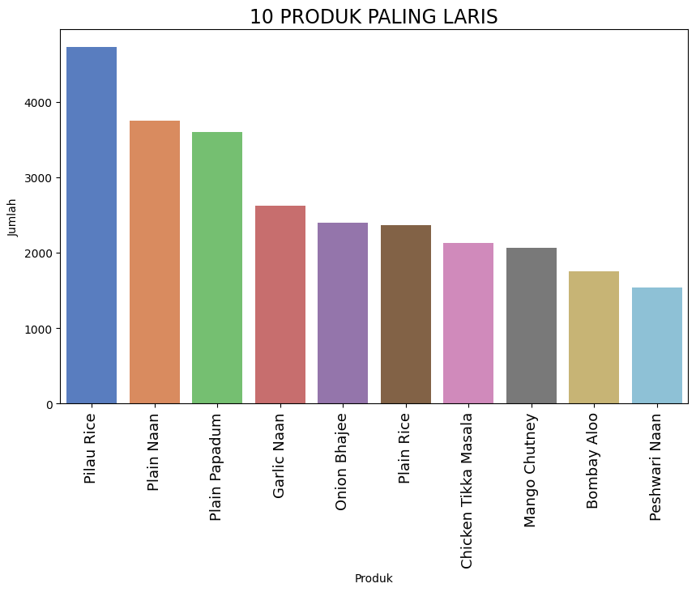
Plot diatas menampilkan10 item yang paling laris. Item-item ini sering dibeli bersama, yang menunjukkan bahwa mereka sering dipesan sebagai bagian dari hidangan utama.<br>
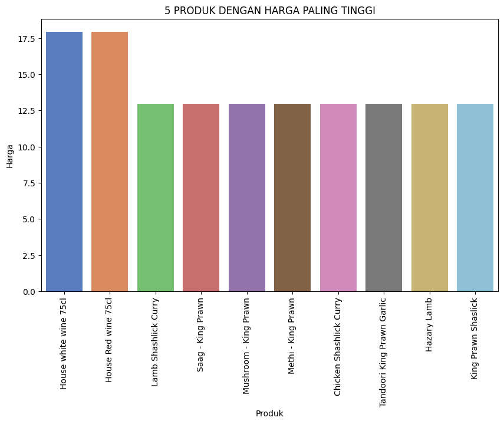
Plot harga item paling tinggi menunjukkan bahwa item-item dengan harga tertinggi. Item-item ini memiliki harga yang tinggi karena bahan-bahannya yang berkualitas dan proses pembuatannya yang rumit.
Dari hasil plot tersebut, restoran dapat menawarkan paket atau promosi untuk meningkatkan nilai pesanan.<br>
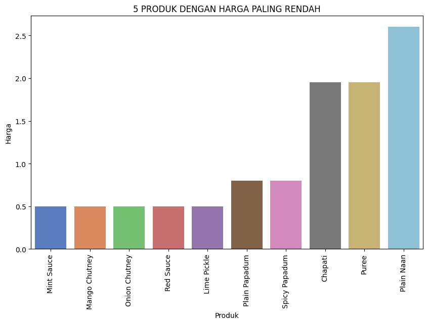
Plot harga item paling rendah menunjukkan bahwa item-item dengan harga terendah. Item-item ini memiliki harga yang rendah karena bahan-bahannya yang sederhana dan proses pembuatannya yang relatif mudah.
Dari hasil plot tersebut, restoran dapat menggunakan informasi ini untuk memasarkan item-item ini sebagai pilihan yang terjangkau.<br>
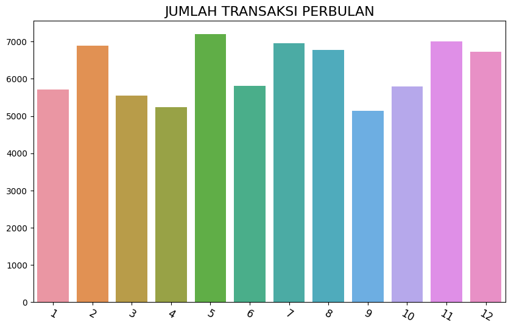
Plot ini menunjukkan jumlah transaksi yang dilakukan per bulan. Jumlah transaksi perbulan meningkat secara signifikan pada bulan ke-5 dengan jumlah transaksi mencapai 7.000.
Restoran dapat mempertimbangkan untuk meningkatkan promosi dan pemasarannya selama bulan-bulan dengan transaksi yang lebih sedikit, tetap menjaga kepuasan pelanggan dan mendorong mereka untuk kembali memesan makanan India..<br>
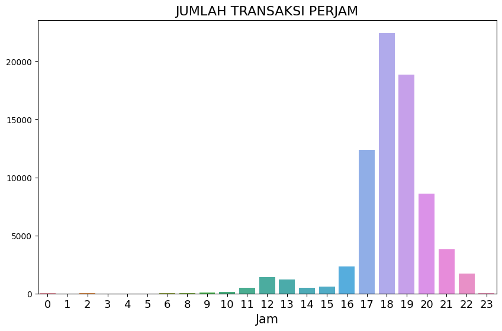
Plot jumlah transaksi per jam menunjukkan bahwa jumlah transaksi tertinggi terjadi pada sore dan malam hari, dengan lonjakan tertinggi terjadi pada pukul 18:00.
Hal ini kemungkinan disebabkan oleh kombinasi faktor, termasuk waktu kerja, peningkatan kesibukan, dan penurunan permintaan untuk makanan India.
Restoran dapat mempertimbangkan untuk menawarkan promosi atau diskon khusus pada pagi hari untuk mendorong lebih banyak transaksi.<br>
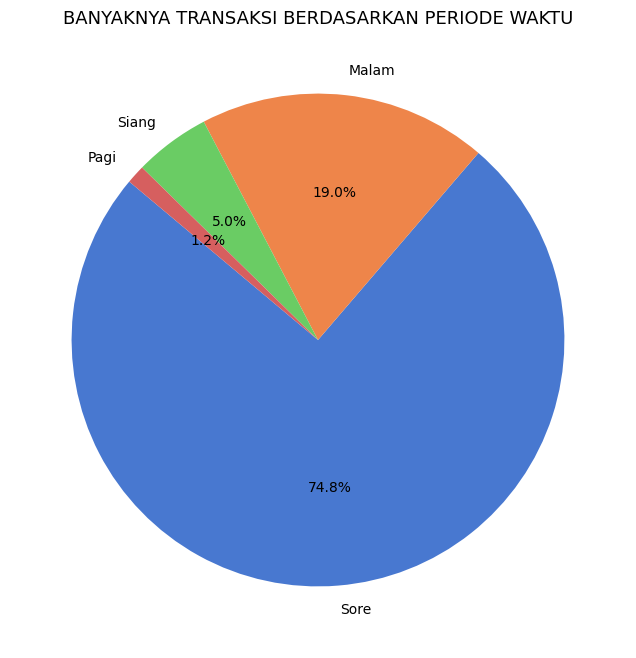
Plot ini menunjukkan waktu dalam sehari di mana terjadi paling banyak transaksi di restoran. Plot ini menunjukkan bahwa waktu paling banyak transaksi adalah di sore hari, yaitu antara pukul 16:00 sampai pukul 20:00.
Restoran dapat mempertimbangkan untuk menawarkan promosi atau diskon khusus pada pagi dan siang hari untuk mendorong lebih banyak transaksi.<br>

## Data Preparation
Data preparation adalah proses awal yang penting dalam melakukan market basket analysis dengan algoritma apriori. Proses ini bertujuan untuk mempersiapkan data agar dapat digunakan oleh algoritma apriori untuk menghasilkan aturan asosiasi.
##### 1. Normalisasi 
Proses mengubah data ke format yang standar dan konsisten.
```python
data["Item Name"] = data["Item Name"].apply(lambda item: item.lower())
```
Proses normalisasi dengan mengubah semua huruf dalam kolom Item Name menjadi huruf kecil, ini dilakukan dengan menggunakan fungsi ```lower()``` dari Python. Fungsi ```lower()``` mengembalikan nilai string dengan semua huruf diubah menjadi huruf kecil.<br>

##### 2. Pembersihan data
Proses menghilangkan data yang tidak valid atau tidak diinginkan dari dataset. 
```python
data["Item Name"] = data["Item Name"].apply(lambda item: item.strip())
```
Proses pembersihan data ini dapat dilakukan dengan menggunakan fungsi ```strip()``` dari Python. Fungsi ```strip()``` mengembalikan nilai string dengan spasi kosong di awal dan akhir dihilangkan.<br>
##### 3. Seleksi data yaitu memilih subset dari dataset berdasarkan kriteria tertentu.
Proses seleksi data ini dapat dilakukan dengan menggunakan fungsi ```loc()``` dari Pandas. Fungsi ```loc()``` mengembalikan subset dari DataFrame berdasarkan indeks atau nama kolom.
Disini seleksi data dilakukan dengan memilih kolom Order Number, Item Name, dan Quantity dari dataset.
```python
item_count = data[["Order Number", "Item Name", "Quantity"]]
item_count.head(10)
```
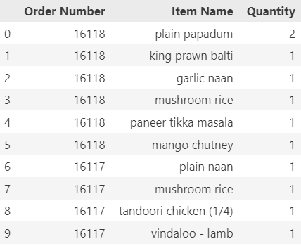

##### 4. Pivot tabel
Teknik untuk mengubah bentuk tabel dengan memutar data untuk melihat hubungan antara nilai-nilai dari berbagai kolom.
Proses ini memungkinkan untuk melakukan analisis multidimensi dan menghasilkan representasi data yang lebih ringkas dan mudah dipahami.
```python
item_count_pivot = item_count.pivot_table(index='Order Number', columns='Item Name', values='Quantity', aggfunc=sum).fillna(0)
item_count_pivot.head()
```
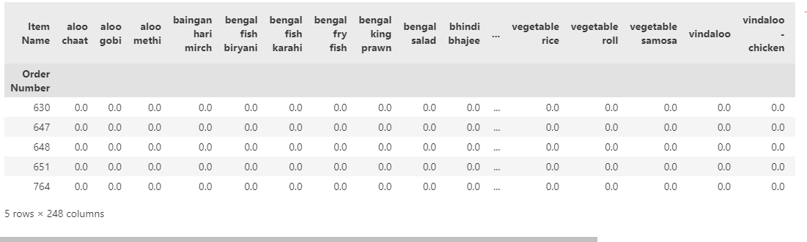

##### 5. Konversi tipe data
Proses mengubah tipe data dari suatu variabel. 
Disini konversi tipe data dilakukan dengan mengubah tipe data kolom Quantity dari pivot tabel ```item_count_pivot``` dari tipe data ```float64``` menjadi tipe data ```int32```.
```python
item_count_pivot = item_count_pivot.astype("int32")
item_count_pivot.head()
```
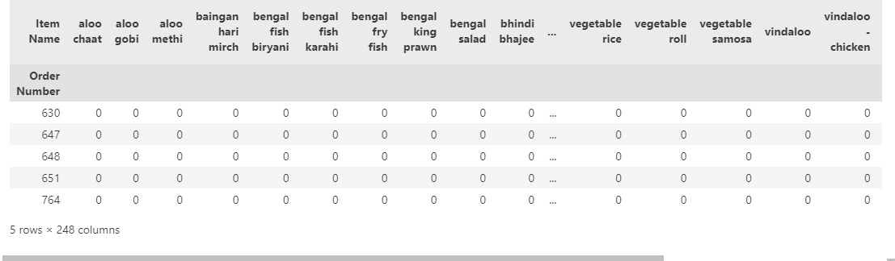

##### 6. Encoding
Proses mengubah nilai-nilai dalam dataset menjadi format yang lebih mudah diproses oleh algoritma machine learning tertentu.
Disini encoding dilakukan dengan mengubah semua nilai quantitas (jumlah item) menjadi nilai biner ```0``` atau ```1``` untuk menunjukkan apakah suatu item dipesan atau tidak.
```python
def encode_units(x):
    if x <= 0:
        return 0
    elif x >= 1:
        return 1

item_count_pivot = item_count_pivot.applymap(encode_units)
item_count_pivot.head()
```
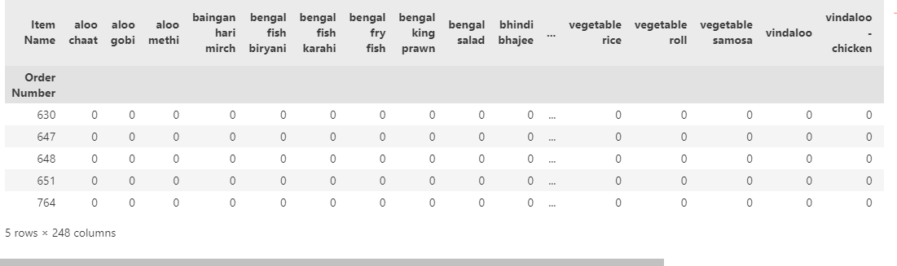

##### 7. Pemeriksaan dimensi data<br>
Proses untuk memeriksa ukuran dan bentuk dari suatu dataset.
Disini pemeriksaan dimensi data dilakukan dengan menggunakan metode ```shape()``` dari Pandas.

```python
print("Ukuran Dataset : ", item_count_pivot.shape)  
print("Jumlah Transaksi :", item_count_pivot.shape[0])     
print("Jumlah Item : ", item_count_pivot.shape[1]) 
```
>Ukuran Dataset :  (13397, 248)
>Jumlah Transaksi : 13397
>Jumlah Item :  248


## Modeling Association Rules - Algoritma Apriori
Algoritma Apriori digunakan untuk menemukan aturan asosiasi dalam data transaksional. Algoritma ini bekerja dengan cara mengenerate aturan asosiasi dari aturan-aturan yang lebih kecil.
##### Pembuatan model asosiasi untuk menemukan item-item yang sering dibeli bersama. 
```python
support = 0.03 
frq_items = apriori(item_count_pivot, min_support = support, use_colnames = True)
frq_items.sort_values("support", ascending=False).head(15)
```
- Menentukan nilai support minimum
```support = 0.03``` menetapkan nilai support minimum untuk aturan asosiasi yang akan ditemukan. Support menunjukkan seberapa sering suatu item atau kumpulan item muncul dalam transaksi. Nilai ```0.03``` berarti item atau kumpulan item harus muncul setidaknya dalam 3% dari total transaksi untuk dipertimbangkan dalam pembuatan aturan asosiasi.
- Menerapkan Algoritma Apriori
Memanggil fungsi ```apriori()``` dari library apriori untuk menerapkan algoritma Apriori. Algoritma ini dirancang untuk menemukan aturan asosiasi yang kuat dalam dataset transaksional.
- Menampilkan item-item yang sering muncul
```frq_items.sort_values("support", ascending=False).head(15)``` menampilkan 15 item atau kumpulan item yang paling sering muncul, diurutkan berdasarkan nilai support dari yang tertinggi ke terendah.
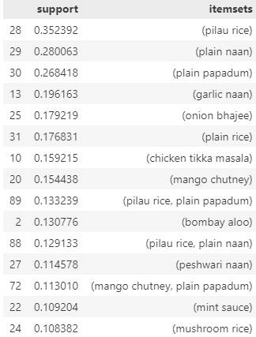

##### Proses penyaringan dan penyusunan aturan asosiasi berdasarkan metrik lift dan nilai confidence minimum
```python
metric = "lift"     
min_threshold = 1   

rules = association_rules(frq_items, metric=metric, min_threshold=min_threshold)[["antecedents", "consequents", "support", "confidence", "lift"]]
rules.sort_values('confidence', ascending=False, inplace=True)

rules.head(15)
```
- Menentukan metric evaluasi
```metric = "lift"``` menetapkan metrik ```"lift"``` sebagai metrik utama untuk mengevaluasi aturan asosiasi. Lift mengukur seberapa kuat hubungan antara ```antecedent``` (item-item yang muncul di bagian "jika") dan ```consequent``` (item-item yang muncul di bagian "maka") dalam aturan asosiasi. Lift yang lebih besar dari 1 menunjukkan hubungan yang positif dan menarik.
- Menentukan nilai threshold minimum
```min_threshold = 1``` menetapkan nilai threshold minimum untuk lift. Hanya aturan asosiasi dengan lift setidaknya 1 yang akan dipertahankan.
- Membuat aturan asosiasi
Memanggil fungsi ```association_rules()``` untuk membuat aturan asosiasi dari kumpulan item yang sering muncul (```frq_items```).
Aturan asosiasi yang dihasilkan hanya akan berisi kolom-kolom:
    - ```antecedents```: Item-item yang muncul di bagian "jika" dalam aturan asosiasi.
    - ```consequents```: Item-item yang muncul di bagian "maka" dalam aturan asosiasi.
    - ```support```: Seberapa sering aturan asosiasi muncul dalam dataset.
    - ```confidence```: Kepercayaan atau kemungkinan consequent muncul dalam transaksi yang mengandung antecedent.
    - ```lift```: Kekuatan hubungan antara antecedent dan consequent.
- Mengurutkan aturan asosiasi
```rules.sort_values('confidence', ascending=False, inplace=True)``` mengurutkan aturan asosiasi berdasarkan nilai ```confidence``` dari yang tertinggi ke terendah. Confidence yang tinggi menunjukkan bahwa ```consequent``` sangat mungkin muncul dalam transaksi yang mengandung ```antecedent```.
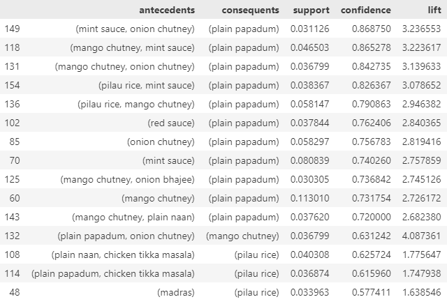

**Kelebihan dan Kekurangan Algoritma Apriori**:
- Kelebihan Algoritma Apriori:
    - Tidak memerlukan data berlabel
     Algoritma Apriori adalah algoritma unsupervised, yang berarti tidak memerlukan data berlabel. Algoritma ini dapat digunakan untuk data yang tidak memiliki label, seperti data transaksional.
    - Mampu menemukan pola dan hubungan yang tersembunyi dalam data transaksional
    Algoritma Apriori dapat menemukan aturan asosiasi antara item yang sering dibeli bersama, yang dapat digunakan untuk memahami pola pembelian pelanggan dan membuat keputusan bisnis yang lebih baik.
    - Mudah dipahami dan diinterpretasikan
    Aturan asosiasi yang dihasilkan oleh algoritma Apriori mudah dipahami dan diinterpretasikan oleh manusia.
    - Dapat diterapkan untuk berbagai jenis dataset
    Algoritma Apriori dapat diterapkan untuk berbagai jenis dataset transaksional, baik dataset kecil maupun besar.
- Kekurangan Algoritma Apriori:
    - Mungkin menghasilkan banyak aturan asosiasi yang tidak relevan
    Algoritma Apriori dapat menghasilkan banyak aturan asosiasi, beberapa di antaranya mungkin tidak relevan dengan tujuan analisis.
    - Membutuhkan banyak perhitungan
    Algoritma Apriori membutuhkan banyak perhitungan, terutama untuk dataset yang besar.
    - Mungkin menghasilkan aturan asosiasi yang palsu
    Aturan asosiasi yang dihasilkan oleh algoritma Apriori mungkin palsu, yang berarti aturan tersebut tidak benar-benar terjadi dalam data.

## Visualisasi Model
##### Visualisasi 3D Scatter of Rules
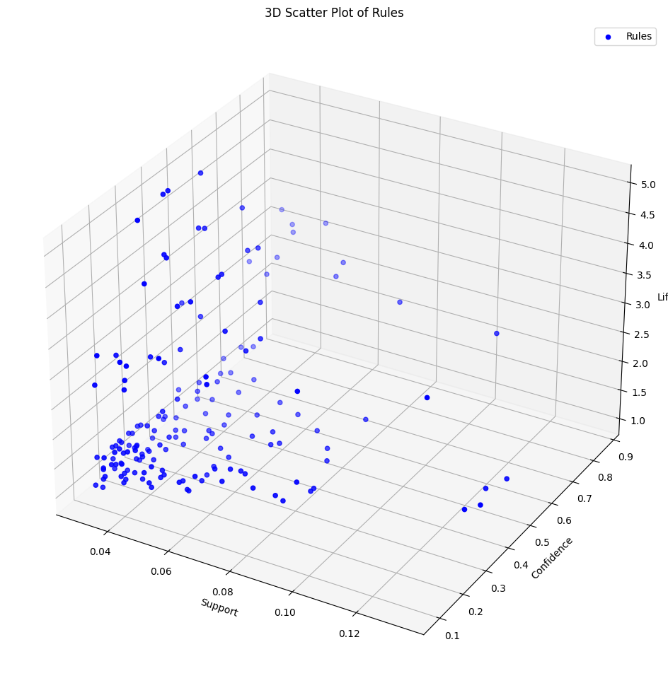
Visualisasi 3D Scatter of Rules adalah visualisasi yang menggunakan tiga dimensi untuk menampilkan tiga karakteristik dari aturan apriori, yaitu:
- **Support** diplot pada sumbu X. Support yang tinggi menunjukkan bahwa aturan tersebut umum terjadi dalam data.
- **Confidence** diplot pada sumbu Y. Confidence yang tinggi menunjukkan bahwa jika antecedent muncul, maka konsekuen kemungkinan besar juga akan muncul.
- **Lift** diplot pada sumbu Z. Lift yang tinggi menunjukkan bahwa aturan tersebut memiliki nilai yang signifikan.
<br>

##### Visualisasi Sunburst Chart
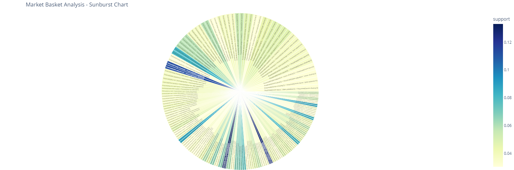
Visualisasi Sunburst Chart adalah visualisasi yang menggunakan sunburst, atau roda matahari, untuk menampilkan tiga karakteristik dari aturan apriori, yaitu:
- **Support** direpresentasikan oleh ukuran sinar matahari. Sinar matahari yang lebih besar mewakili aturan dengan support yang lebih tinggi.
- **Confidence** direpresentasikan oleh warna sinar matahari. Sinar matahari dengan warna yang lebih terang mewakili aturan dengan confidence yang lebih tinggi.
- **Lift** direpresentasikan oleh sudut sinar matahari. Sinar matahari yang lebih dekat ke pusat mewakili aturan dengan lift yang lebih tinggi.
Dalam visualisasi ini, setiap sinar matahari mewakili satu aturan apriori. Sinar matahari yang lebih besar mewakili aturan yang lebih penting.
<br>

##### Visualisasi Support vs. Confidence
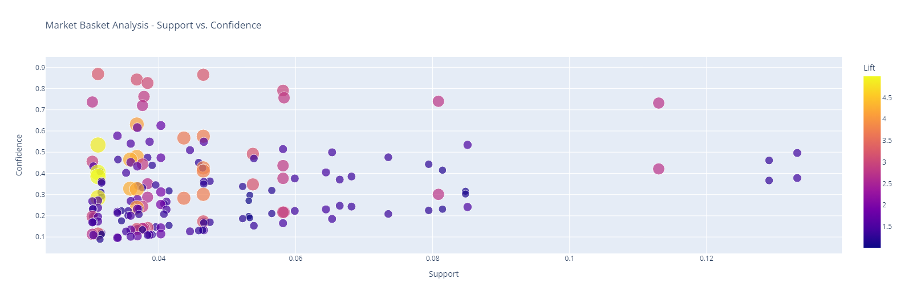
Visualisasi Support vs. Confidence adalah visualisasi yang menggunakan dua dimensi untuk menampilkan dua karakteristik dari aturan apriori, yaitu:
- **Support** diplot pada sumbu X. Support yang tinggi menunjukkan bahwa aturan tersebut umum terjadi dalam data.
- **Confidence** diplot pada sumbu Y. Confidence yang tinggi menunjukkan bahwa jika antecedent muncul, maka konsekuen kemungkinan besar juga akan muncul.
Dalam visualisasi ini, setiap titik mewakili satu aturan apriori. Titik-titik yang dekat satu sama lain menunjukkan bahwa aturan-aturan tersebut memiliki karakteristik yang serupa.
<br>
#### Interpretasi Visualisasi
Berikut adalah beberapa interpretasi yang dapat dilakukan dari ketiga visualisasi tersebut:
##### Visualisasi 3D Scatter of Rules: 
- Aturan dengan support dan confidence yang tinggi adalah aturan yang paling penting.
- Aturan dengan support yang tinggi dan confidence yang rendah adalah aturan yang umum terjadi, tetapi kemungkinan terjadi jika antecedent telah muncul tidak terlalu tinggi.
- Aturan dengan support yang rendah dan confidence yang tinggi adalah aturan yang jarang terjadi, tetapi kemungkinan terjadi jika antecedent telah muncul sangat tinggi.
##### Visualisasi Sunburst Chart: 
- Aturan dengan ukuran sinar matahari yang besar adalah aturan yang paling penting.
- Aturan dengan warna sinar matahari yang lebih terang adalah aturan yang lebih umum terjadi.
- Aturan dengan sudut sinar matahari yang lebih dekat ke pusat adalah aturan yang memiliki nilai yang signifikan.
##### Visualisasi Support vs. Confidence: 
- Aturan dengan support dan confidence yang tinggi adalah aturan yang paling penting.
- Aturan dengan support yang tinggi dan confidence yang rendah adalah aturan yang umum terjadi, tetapi kemungkinan terjadi jika antecedent telah muncul tidak terlalu tinggi.
- Aturan dengan support yang rendah dan confidence yang tinggi adalah aturan yang jarang terjadi, tetapi kemungkinan terjadi jika antecedent telah muncul sangat tinggi.

Pemilihan visualisasi yang tepat tergantung pada tujuan analisis. Jika tujuannya adalah untuk mengidentifikasi aturan apriori yang paling penting, maka visualisasi 3D Scatter of Rules atau visualisasi Support vs. Confidence dapat digunakan. Jika tujuannya adalah untuk melihat pola-pola yang muncul dalam data, maka visualisasi Sunburst Chart dapat digunakan.

<br>
##### Deployments
Coba sekarang, disini : 
Streamlit App - Market Basket Analysis Indian Food Orders - Apriori Algorithm <br>

[Streamlit Link](https://app-mbaindianfoodorders-8y8dkb7qytgkt5eilykxft.streamlit.app/)

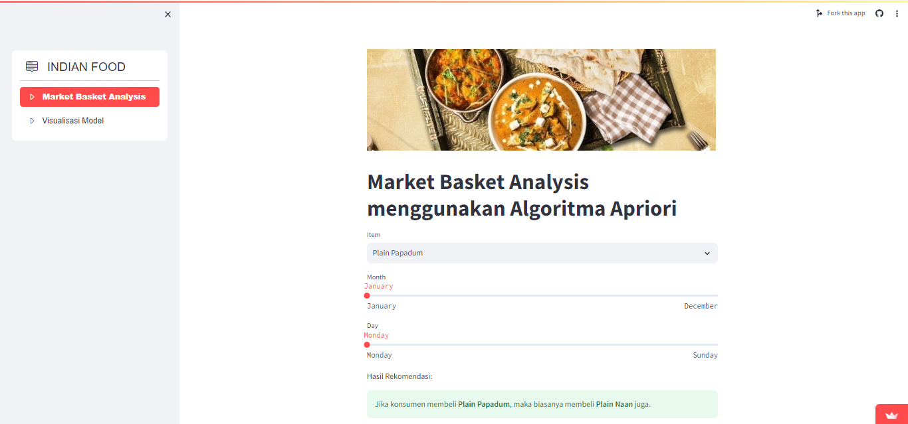
